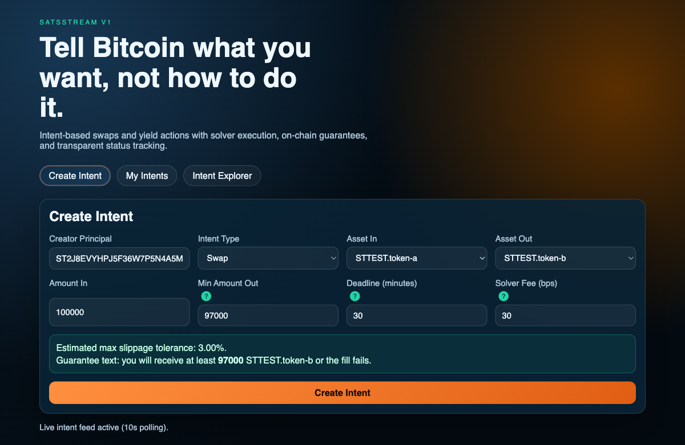
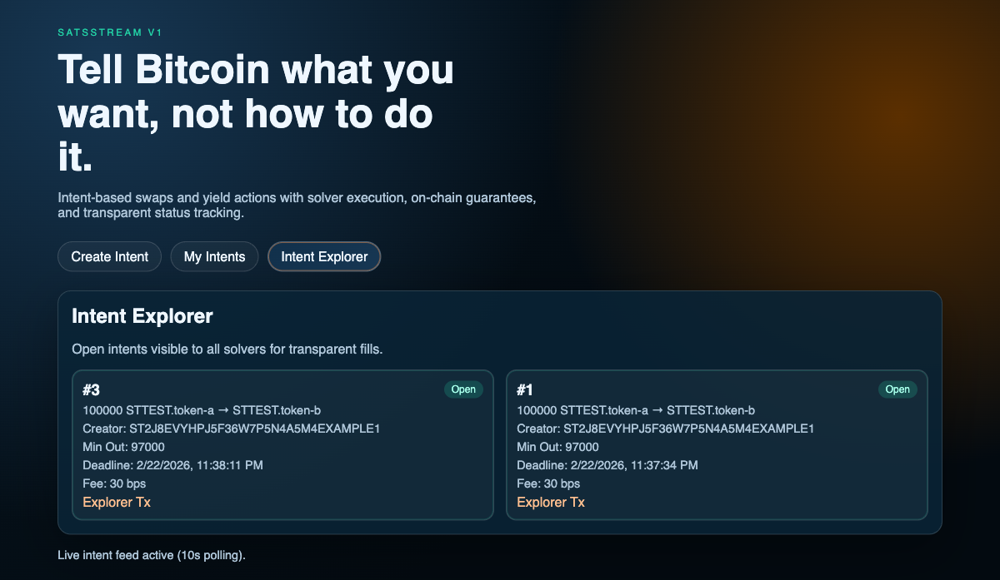

# SatsStream Intent Router (v1)

Bitcoin users usually know the outcome they want, but not the safest or best execution path.
SatsStream lets users post outcome-based intents (swap/yield) with explicit guarantees, then lets solvers execute them.
Stacks + Clarity give deterministic, auditable settlement while anchoring security and finality to Bitcoin.
This is built for Bitcoin users, wallet teams, and BTCFi apps that want intent UX without giving up transparency.

## How this uses Stacks & Bitcoin

- Clarity settlement: intents are created, escrowed, filled, and canceled in the `intent-router.clar` contract with on-chain rules.
- Bitcoin-denominated intents: amounts are modeled in Bitcoin-native units/sats-style UX (v1 demo tokens mirror this flow in test mode).
- Path to real liquidity: the v1 quote source is modular, so internal pricing can be replaced by sBTC/USDCx/Bitflow routing adapters.

## Screenshots

Create Intent flow:



Intent Explorer flow:



## Judges cheat sheet

- Innovation: Bitcoin intent UX where users declare outcome constraints and solvers handle execution pathing.
- Technical Depth: Clarity escrow/validation contract + off-chain solver/indexer architecture + deterministic fill constraints.
- UX: simple Create Intent / My Intents / Intent Explorer flows with min-out, deadline, and solver-fee guidance.
- Ecosystem Impact: modular routing layer designed to plug into Stacks BTCFi primitives like sBTC, USDCx, and Bitflow.

## 1. Intent format (spec)

Each intent stores the following fields:

- `id` (`uint`)
- `creator` (`principal`)
- `intent-type` (`swap` = `u0`, `yield` = `u1`)
- `token-in` (`principal` contract id)
- `token-out` (`principal` contract id)
- `amount-in` (`uint`)
- `min-amount-out` (`uint`)
- `deadline` (`uint`, block-height surrogate)
- `solver-fee-bps` (`uint`)
- `status` (`open` = `u0`, `filled` = `u1`, `canceled` = `u2`, `expired` = `u3`)

### Constraints implemented

- Only creator can cancel.
- Fill must be before deadline (otherwise intent resolves as expired).
- Fill must satisfy `min-amount-out`.
- Single fill per id in v1 (no partial fills).

## 2. Contract: `IntentRouter`

Path: `contracts/intent-router.clar`

### Core functions

- `create-intent(...)`
  - validates input
  - escrows `amount-in` from creator into router
  - stores intent
- `cancel-intent(id, token-in)`
  - creator-only
  - open-only
  - refunds `amount-in`
- `fill-intent(id, path-data, token-in, token-out)`
  - open-only + not expired
  - computes v1 output from internal price table
  - checks output >= `min-amount-out`
  - sends output to creator
  - pays solver fee
  - releases maker input to solver
  - marks intent as filled
- `get-intent(id)` (read-only)
- `list-intents(offset, limit)` (read-only, capped page size)

### v1 routing model

Routing is intentionally simplified with `set-internal-price(...)` as the quote source.
That keeps the settlement path deterministic while preserving a modular slot for richer routing logic later.

## 3. Off-chain solver bot

Path: `indexer/src/solver.ts`

Responsibilities implemented:

- polls open intents
- fetches quote from internal quote engine (`indexer/src/quote-engine.ts`)
- fills valid intents via `fill-intent`
- skips intents failing min-out/deadline checks

For the hack, single solver is expected and supported.

## 4. Frontend UX

Path: `frontend/`

Screens implemented:

- Create Intent
- My Intents
- Intent Explorer

UX elements included:

- Copy: "Tell Bitcoin what you want, not how to do it."
- Tooltips for solver fee and min-out
- Deadline/slippage warnings
- Explorer tx links when tx ids are available

## No browser local storage

The frontend uses API polling only and does not use `localStorage`, `sessionStorage`, or IndexedDB.
State persistence is on-chain (or mock in-memory mode for free local demo).

## Quick start (fully free local demo)

```bash
npm install
cp indexer/.env.example indexer/.env
npm run dev:indexer
npm run dev:solver
npm run dev:frontend
```

- Indexer API: `http://localhost:8787/api`
- Frontend: `http://localhost:5173`

## On-chain mode

Set in `indexer/.env`:

- `MOCK_MODE=false`
- `STACKS_API_URL`
- `CONTRACT_ID=<address>.intent-router`
- `RELAYER_PRIVATE_KEY`
- `SOLVER_PRIVATE_KEY`

Then run the same dev scripts.

## Free GitHub deployment path

- Frontend: GitHub Pages via `.github/workflows/deploy-frontend.yml`
- Solver: GitHub Actions scheduled job via `.github/workflows/solver-cron.yml`
- CI: `.github/workflows/ci.yml`

This stack keeps infra costs at zero for hack/demo scale.
